# Sampling Assignment – Handling Imbalanced Credit Card Data


---

##  Objective
To understand the importance of **sampling techniques** in handling **imbalanced datasets** and analyze how different sampling strategies affect the performance of multiple **machine learning models**.

---

## Dataset Overview
The dataset consists of credit card transactions with a **severely imbalanced target variable**, where fraudulent transactions form a very small minority.

### Class Distribution (Before Sampling)
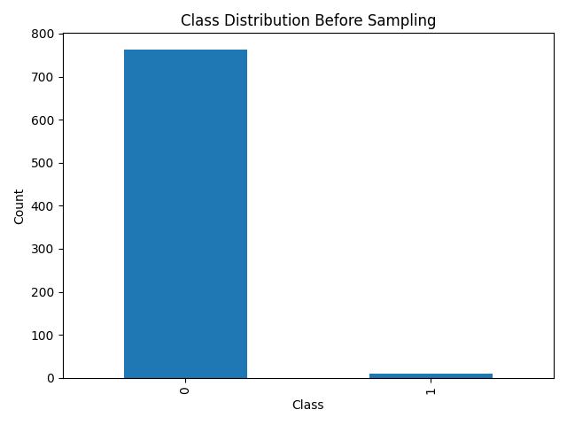

### Class Distribution After Random Over Sampling
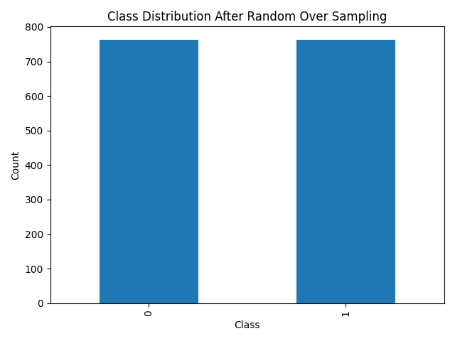

### Class Distribution After SMOTE
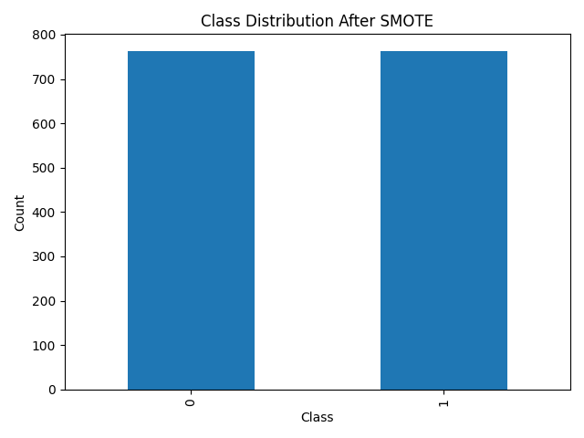

---

## Overall Workflow (Flow Diagram)

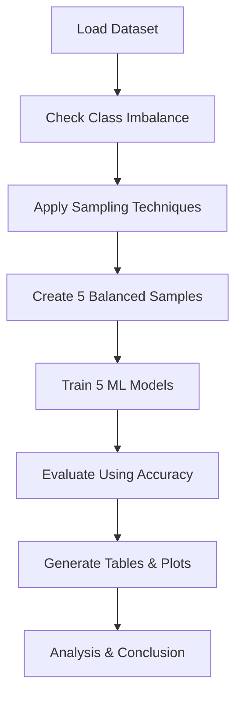

---

## Sampling Techniques Used

| Sampling ID | Technique |
|------------|----------|
| Sampling1 | Random Over Sampling (ROS) |
| Sampling2 | Random Under Sampling (RUS) |
| Sampling3 | SMOTE |
| Sampling4 | NearMiss |
| Sampling5 | Stratified Sampling |

---

## 🤖 Machine Learning Models

| Model ID | Model |
|--------|-------|
| M1 | Logistic Regression |
| M2 | Decision Tree |
| M3 | Random Forest |
| M4 | Support Vector Machine (SVM) |
| M5 | K-Nearest Neighbors (KNN) |

---

## Accuracy Comparison

### Accuracy Heatmap (Models vs Sampling Techniques)
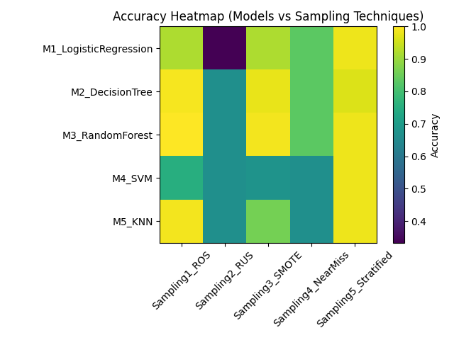

### Accuracy Matrix Table
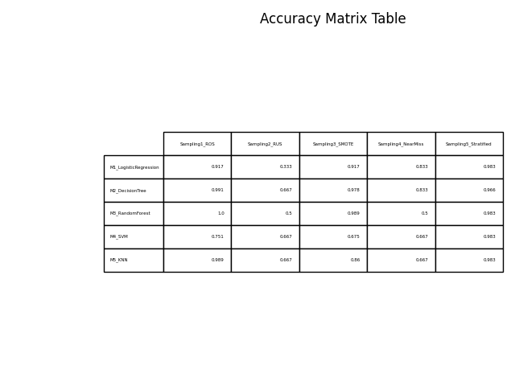

---

## Detailed Comparative Analysis

### Model-wise Accuracy Comparison
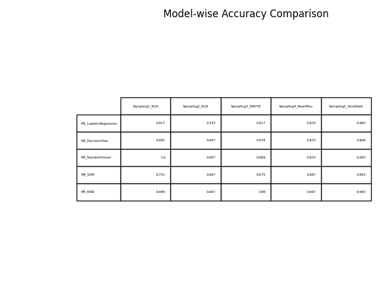

### Accuracy Trend Across Sampling Techniques
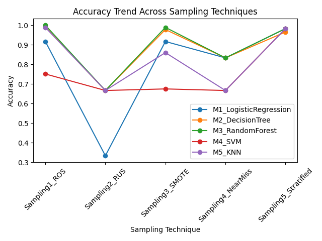

---

##  Distribution Analysis

### Accuracy Distribution per Sampling Technique
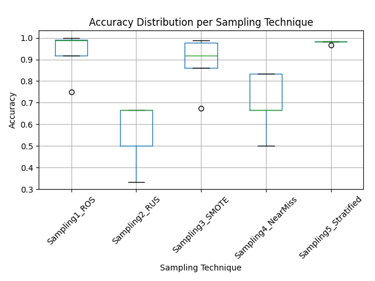

### Accuracy Distribution per Model
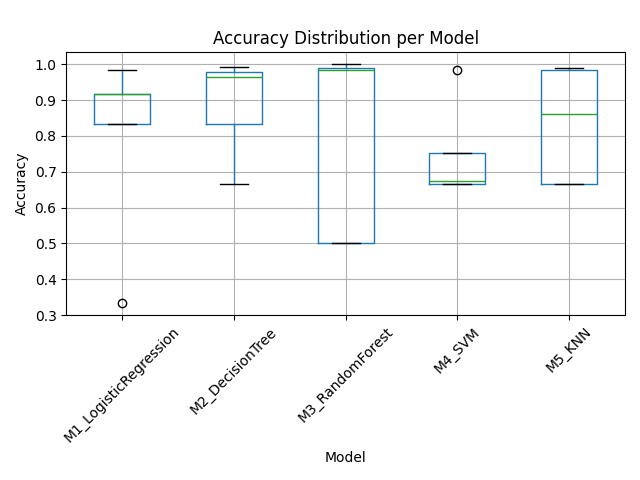

---

##  Mean Accuracy Analysis

### Mean Accuracy per Sampling Technique
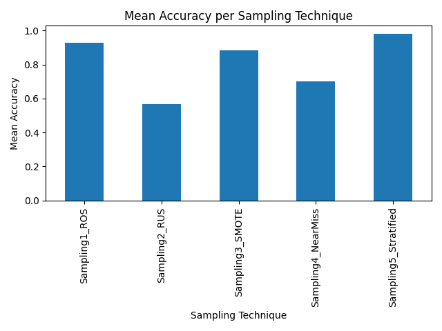

### Mean Accuracy per Model
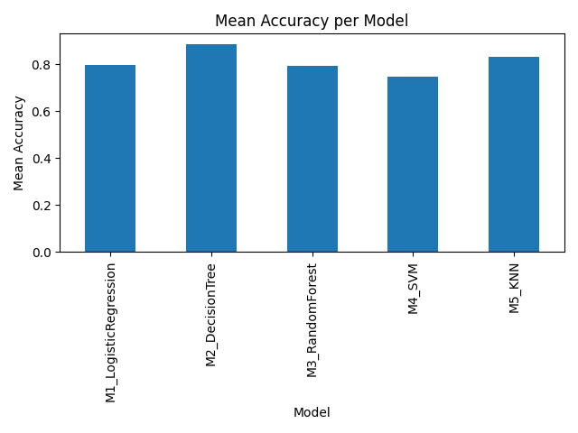

---


##  Results

Based on the experimental results:

- **Logistic Regression** achieved its highest accuracy with **Stratified Sampling** (≈ 98.3%).
- **Decision Tree** performed best with **Random Over Sampling (ROS)** (≈ 99.1%), indicating strong sensitivity to class balance.
- **Random Forest** showed best and stable performance with **SMOTE** (≈ 98.9%), avoiding inflated accuracy from duplicated samples.
- **SVM** achieved its highest accuracy using **Stratified Sampling** (≈ 98.3%).
- **KNN** performed best with **Random Over Sampling (ROS)** (≈ 98.9%).

Overall, the results confirm that **no single sampling technique is optimal for all models**, and the choice of sampling method significantly influences model performance.


---

## 🧠 Key Observations
- Oversampling techniques (ROS, SMOTE) generally improve performance.
- Under-sampling methods may cause information loss on small datasets.
- Tree-based models can overfit when datasets are very small.
- No single sampling technique is optimal for all models.

---

## 📁 Repository Structure

```
Sampling_Assignment/
├── data/
│   └── Creditcard_data.csv
├── src/
│   └── sampling_assignment.py
├── results/
│   ├── *.png
│   ├── *.csv
└── README.md
```

---


## ✅ Conclusion

This study demonstrates that handling class imbalance through appropriate sampling techniques is essential for reliable machine learning performance. The experimental results show that different models respond differently to sampling strategies:

- Stratified Sampling performed best for Logistic Regression and SVM.
- Random Over Sampling was most effective for Decision Tree and KNN.
- SMOTE provided the most stable and reliable performance for Random Forest.

Overall, the results confirm that **there is no universally best sampling technique**, and the choice of sampling method should be based on the model being used.


---

## ✍️ Author
**Manleen Kaur**
